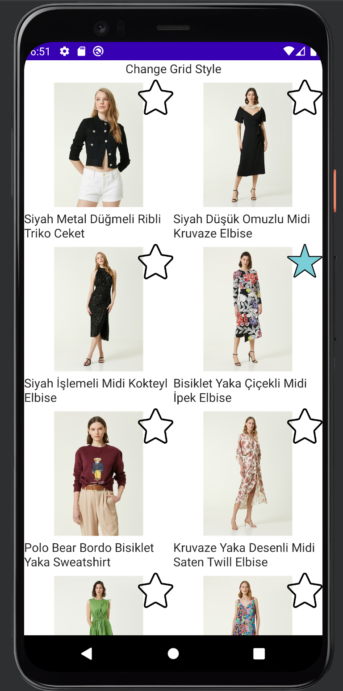
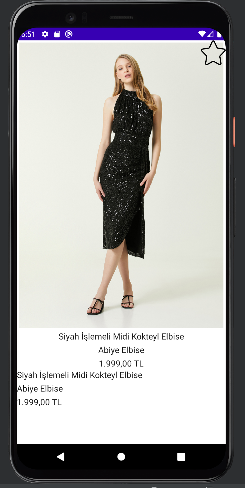

# Beymen Challenge

- Implemented and Tested on Pixel 4 API 29

## Left TODO

- Error handling
- Pagination for vertical grid
- Improve UI responsiveness

## Tech

Application uses the following libraries and etc. :

- [Jetpack Compose] - Library for Drawing UI
- [Coroutines] - Library for async taks
- [Coil] - Library for async image loading to compose.
- [Retrofit] - Library for getting data from remote.
- [Room] - Library for local database.
- [Hilt] - Library for dependency injection.

## Installation

Download the code and run.

## 📱 Screenshots

  

  

